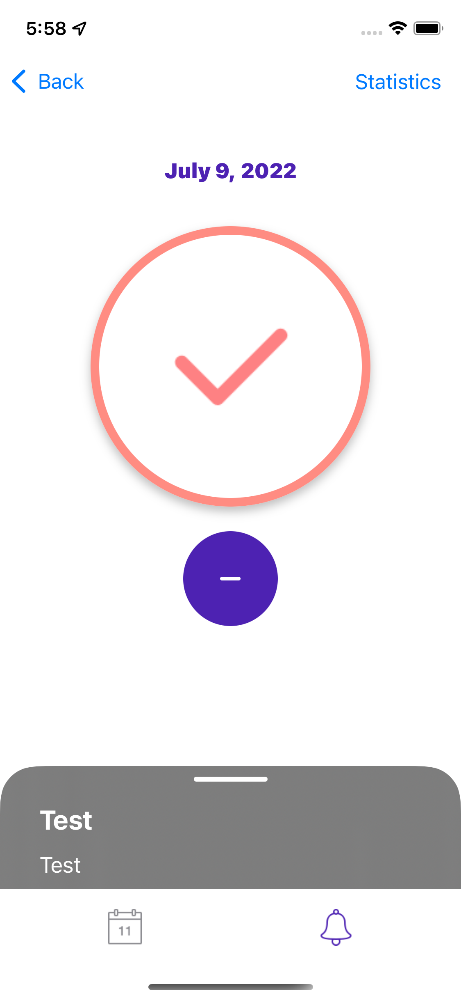

# habit-tracker-ios
Habit tracker iOS mobile app built for my school course EBC-VI1 - Application Development for iOS course.
# What I Learned
* CoreData: Creation of multiple entities and the relationships between them, dynamic queries to CoreData
* Combine framework
* Designed in **MVVM** architecture
* UserNotifications framework: notification trigger depending on day of week and time 
* The map operation is managed and regulated by **LocationManager**
# Main Features

## Screenshot

  
  
   
  
  
  
   

